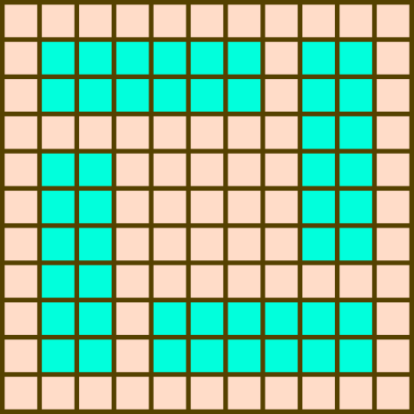
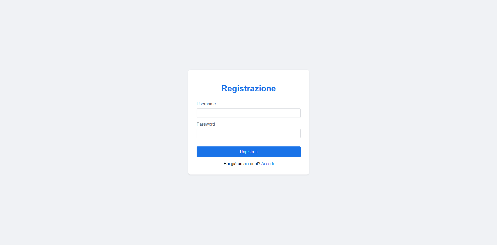
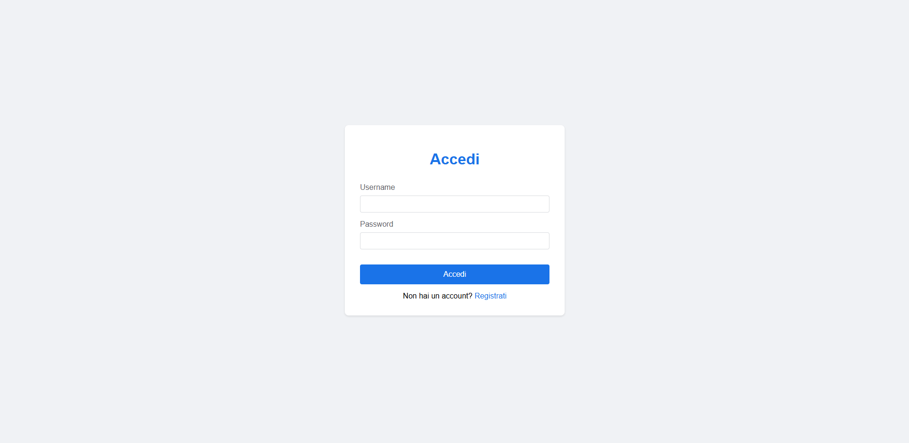
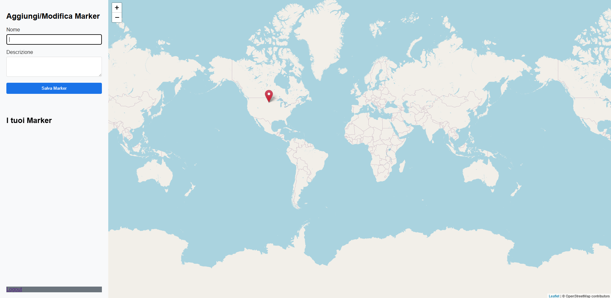

> Documentazione tecnica “Prog Mappa”.

● 1. Introduzione

> ● 1.1 Scopo del Software
>
> ○ Lo scopo del software è fornire un'interfaccia web interattiva che
> consenta agli utenti registrati di visualizzare e inserire marker su
> una mappa. Ogni marker contiene coordinate geografiche, la data di
> creazione, l’autore, e viene mostrato sia sulla mappa sia all’interno
> di un post-it dedicato. ● 1.2 Descrizione Generale del Software
>
> ○ Il software è una single-page application (SPA) che mostra
> inizialmente una schermata di login. Se l’utente non è registrato, può
> accedere alla pagina di registrazione tramite un link. Una volta
> effettuato il login, l’utente viene reindirizzato alla pagina
> principale con la mappa. Sulla mappa è possibile aggiungere marker e
> visualizzarli anche come note laterali.
>
> ● 1.3 Obiettivi della Documentazione
>
> ○ Fornire una panoramica chiara del funzionamento del software,
> dell’architettura utilizzata, dei componenti principali, delle
> proprietà qualitative e della strategia di testing.
>
> ● 1.4 Panoramica del Documento
>
> ○ La documentazione è suddivisa in sezioni che trattano architettura,
> proprietà, design, codice, testing, deployment, manutenzione,
> conclusioni e appendici.

● 2. Architettura del Software

> ● 2.1 Descrizione Generale dell'Architettura
>
> ○ Server: sviluppato in JavaScript (Node.js) con Express, gestisce
> l’autenticazione (login/registrazione) e fornisce le rotte per il
> salvataggio e la lettura dei marker.
>
> ○ Frontend: realizzato con EJS (Embedded JavaScript Templates),
> consente il rendering dinamico della mappa e dei marker.
>
> ○ Marker: i dati dei marker (coordinate, autore, data) sono salvati in
> un file .json, che viene letto e aggiornato dal server.
>
> ● 2.2 Componenti Principali ○ Login/Register Page
>
> ○ Map Page (con visualizzazione marker) ○ Post-it Panel (lista dei
> marker)
>
> ● 2.3 Flusso di Dati
>
> ○ L’utente effettua il login
>
> ○ Se autenticato, accede alla mappa ○ Può aggiungere marker

○ Marker visualizzati sia sulla mappa sia nel pannello laterale ● 3.
Analisi delle Proprietà

> ● 3.1 Robustezza
>
> ● 3.1.1 Definizione di Robustezza nel Contesto del Software
>
> ○ La robustezza riguarda la capacità del software di gestire input
> errati e condizioni impreviste senza crash.
>
> ● 3.1.2 Gestione degli Errori
>
> ○ Controllo input nei form, validazione dati lato client e server,
> messaggi di errore chiari.
>
> ● 3.1.3 Test di Robustezza
>
> ○ Test con credenziali errate, dati mancanti, coordinate non valide. ●
> 3.1.4 Resilienza del Software
>
> ○ Il sistema avvisa l’utente in caso di errore, senza bloccare
> l’esperienza. ● 3.1.5 Codice Documentato per la Gestione degli Errori
>
> ○ Presenti commenti esplicativi nei punti di validazione e gestione
> errori. ● 3.2 Usabilità
>
> ● 3.2.1 Definizione di Usabilità nel Contesto del Software
>
> ○ Facilità con cui l’utente può interagire con il software. ● 3.2.2
> Interfaccia Utente (UI) e User Experience (UX)
>
> ○ Design semplice e intuitivo, schermata di login/registrazione
> chiara, pulsanti ben visibili.
>
> ● 3.2.3 Accessibilità
>
> ○ Testato su schermi di diverse dimensioni, colori leggibili.
>
> ● 3.2.4 Feedback degli Utenti
>
> ○ Interazioni con i docenti e compagni per ottenere suggerimenti.
>
> ● 3.2.5 Codice Documentato per la UI/UX
>
> ○ Commenti nei componenti UI (React) per spiegare le funzionalità. ●
> 3.3 Portabilità
>
> ● 3.3.1 Definizione di Portabilità nel Contesto del Software
>
> ○ Capacità del software di essere eseguito su ambienti diversi. ●
> 3.3.2 Compatibilità tra Piattaforme
>
> ○ Funzionante su principali browser (Chrome, Firefox, Edge). ● 3.3.3
> Dipendenze Esterne e Gestione della Configurazione
>
> ○ Uso di librerie standard (Ejs, Bootstrap, Express). ● 3.3.4
> Strategie di Testing Cross-Platform
>
> ○ Verifica su più sistemi operativi e dispositivi mobili. ● 3.3.5
> Codice Documentato per la Portabilità

○ Commenti sui file di configurazione per spiegare l’ambiente. ● 4.
Design del Software

> ● 4.1 Principi di Design Adottati
>
> ○ Separation of Concerns: La logica di frontend (views) è separata dal
> backend (server.js)
>
> ○ Modularità: Le funzionalità sono organizzate in componenti
> riutilizzabili (es. form di login/registrazione)
>
> ○ Responsabilità Singola: Ogni file ha uno scopo ben definito (es.
> map.ejs per la mappa, login.ejs per l'autenticazione)
>
> ● 4.2 Pattern di Design Utilizzati
>
> ○ View: file EJS (map.ejs, login.ejs, register.ejs) ○ Controller:
> server.js gestisce le rotte e la logica
>
> ○ Model: dati memorizzati in JSON (markers.json, users.json)
>
> ● 4.3 Scelte Architetturali e Motivi
>
> ○ Architettura Client-Server: Frontend leggero che comunica via API
> REST
>
> con il backend
>
> ○ Session-based Authentication: Gestione delle sessioni tramite
> cookies ○ Leaflet.js: Scelto per la sua leggerezza e facilità d'uso
> per mappe interattive

● 5. Documentazione del Codice

> ● 5.1 Struttura del Codice Sorgente ├── data/ \# Dati persistenti
>
> │ ├── markers.json \# Database dei marker │ └── users.json \# Database
> degli utenti ├── views/ \# Frontend
>
> │ ├── map.ejs \# Vista principale della mappa │ ├── login.ejs \#
> Pagina di login
>
> │ └── register.ejs \# Pagina di registrazione └── server.js \# Backend
> principale
>
> ● 5.2 Classi e Metodi Principali
>
> ○ initMap(): Inizializza la mappa Leaflet ○ loadMarkers(): Carica i
> marker via API
>
> ○ addMarkerToMap(): Aggiunge un marker alla mappa ○ selectMarker():
> Gestisce la selezione dei marker
>
> ● 5.3 Commenti e Note Importanti nel Codice
>
> ○ Il codice ha vari commenti per rendere il tutto piu capibile e
> semplice da comprendere
>
> ● 5.4 Esempi di Utilizzo del Codice ○ Aggiunta di un nuovo marker:
>
> // In map.ejs
>
> map.on('click', function(e) { // Crea marker temporaneo
>
> currentMarker = L.marker(e.latlng, {icon: redMarkerIcon}).addTo(map);
> // Salva coordinate nel form
> document.getElementById('markerForm').dataset.lat = e.latlng.lat;
> document.getElementById('markerForm').dataset.lng = e.latlng.lng;
>
> });
>
> ● 5.5 Snippet di Codice per le Proprietà Analizzate - Codice per la
> Robustezza - Codice per l'Usabilità - Codice per la Portabilità ○
> Robustezza:
>
> // Verifica permessi prima di modificare/eliminare marker
>
> if (markers\[markerId\].data.user_id !== parseInt('\<%= session.userId
> %\>')) {
>
> alert('Non hai il permesso di modificare questo marker'); return;
>
> }
>
> ○ Usabilità:
>
> // Feedback visivo per marker selezionabili markerItem.onclick = ()
> =\> { selectMarker(data);
>
> map.setView(\[data.latitude, data.longitude\], 13); };
>
> ○ Portabilità:
>
> // Utilizzo di CDN per dipendenze esterne
>
> \<script
> src="https://unpkg.com/leaflet@1.7.1/dist/leaflet.js"\>\</script\>

● 6. Testing

> ● 6.1 Strategia di Testing
>
> ○ Test Manuali: Verifica funzionalità base (login, registrazione,
> creazione marker)
>
> ○ Test di Integrazione: Verifica comunicazione frontend-backend ● 6.2
> Test Unitari
>
> // Esempio di test per la funzione di selezione marker function
> testSelectMarker() {
>
> const testMarker = {id: 1, user_id: 123, name: "Test", description:
> "Test"};
>
> selectMarker(testMarker);
>
> // Verifica che il form sia popolato correttamente
> assert(document.getElementById('markerName').value === "Test");
>
> }
>
> ● 6.3 Test di Performance e Stress
>
> ○ il programma anche se con tanti utenti e marker non si impalla e non
> va in crash
>
> ● 6.4 Risultati dei Test e Report
>
> ○ i risultati sono stati ottimali e non ci sono stati errori nei
> riscontri

● 7. Deployment e Portabilità

> ● 7.1 Guida al Deployment ○ 1. Installare Node.js
>
> ○ 2. \`npm install\` per le dipendenze
>
> ○ 3. \`node server.js\` per avviare il server ● 7.2 Ambienti di
> Produzione e Sviluppo
>
> ○ Sviluppo: Eseguito localmente su http://localhost:3000
>
> ○ Produzione: Può essere deployato su qualsiasi servizio Node.js
>
> (es. Heroku, Vercel)

● 8. Manutenzione del Software ● 8.1 Strategie di Manutenzione

> ○ Utilizzare come aiuto i commenti per aiutarsi a capire in quale
> parte del codice appare il crash o l’errore
>
> ● 8.2 Aggiornamenti del Software
>
> ○ facile aggiornare il codice senza che si formi confusione nel codice
> ● 8.3 Backup e Recupero dei Dati
>
> ○ Il programma per come e adesso e leggero e semplice quindi
>
> semplicemente portabile in una chiavetta o possibile tenerlo senza
> occupare poco spazio ed averlo a portata di mano sempre
>
> ● 9. Conclusioni
>
> ● 9.1 Sintesi delle Proprietà Analizzate
>
> ○ Robustezza: il sistema gestisce correttamente errori comuni come
> credenziali errate, input vuoti o malformati e accessi non
> autorizzati. L’utilizzo di controlli sia lato client che lato server
> garantisce una
>
> protezione di base da comportamenti imprevisti. In caso di errore, il
> software fornisce feedback chiari all’utente senza interrompere
> l’esperienza.
>
> ○ Usabilità: l’interfaccia, realizzata con EJS, è semplice e
> accessibile. La navigazione tra login, registrazione e mappa è
> intuitiva. I marker sono facili da inserire e visualizzare sia sulla
> mappa che nel post-it dedicato, rendendo l’interazione con il sistema
> rapida ed efficace.
>
> ○ Portabilità: l’applicazione è compatibile con diversi browser e
> dispositivi. Il salvataggio dei dati dei marker in un file .json
> semplifica la gestione e
>
> l'esecuzione del progetto su diversi ambienti, purché siano dotati di
> Node.js. Non sono presenti dipendenze complesse o difficili da
> configurare.
>
> ● 9.2 Suggerimenti Futuri per il Miglioramento
>
> ○ Dare una migliore utilità al programma

○ Migliorare la funzionalita dei login e registrazione ● 10. Codice del
Programma

> ● 10.1 server.js

const express = require('express');

const session = require('express-session');

const FileStore = require('session-file-store')(session);

const bcrypt = require('bcryptjs');

const path = require('path');

const fs = require('fs');

const bodyParser = require('body-parser');

const app = express();

const port = 3000;

// Percorsi dei file JSON

const usersPath = path.join(\_\_dirname, 'data', 'users.json');

const markersPath = path.join(\_\_dirname, 'data', 'markers.json');

// Funzioni di utilità per la gestione dei file JSON

const readJsonFile = (filePath) =\> {

> try {
>
> const data = fs.readFileSync(filePath, 'utf8');
>
> return JSON.parse(data);
>
> } catch (error) {
>
> return \[\];
>
> }

};

const writeJsonFile = (filePath, data) =\> {

> fs.writeFileSync(filePath, JSON.stringify(data, null, 2));

};

// Configurazione middleware

app.use(bodyParser.json());

app.use(bodyParser.urlencoded({ extended: true }));

app.use(express.static('public'));

app.set('view engine', 'ejs');

// Assicurati che la cartella sessions esista

const sessionsDir = path.join(\_\_dirname, 'sessions');

if (!fs.existsSync(sessionsDir)) {

> fs.mkdirSync(sessionsDir, { recursive: true });

}

// Configurazione sessione

app.use(session({

> store: new FileStore({
>
> path: sessionsDir,
>
> retries: 0,
>
> logFn: () =\> {}
>
> }),
>
> secret: 'your_secret_key',
>
> resave: false,
>
> saveUninitialized: false,
>
> cookie: { secure: false }

}));

// Middleware per verificare l'autenticazione

const requireLogin = (req, res, next) =\> {

> if (req.session.userId) {
>
> next();
>
> } else {
>
> res.redirect('/login');
>
> }

};

// Rotte per l'autenticazione

app.get('/login', (req, res) =\> {

> res.render('login');

});

app.get('/register', (req, res) =\> {

> res.render('register');

});

app.post('/register', async (req, res) =\> {

> const { username, password } = req.body;
>
> try {
>
> const users = readJsonFile(usersPath);
>
> if (users.find(u =\> u.username === username)) {
>
> res.status(400).json({ error: 'Username già in uso' });
>
> return;
>
> }
>
> const hashedPassword = await bcrypt.hash(password, 10);
>
> const newUser = {
>
> id: users.length \> 0 ? Math.max(...users.map(u =\> u.id)) + 1 : 1,
>
> username,
>
> password: hashedPassword
>
> };
>
> users.push(newUser);
>
> writeJsonFile(usersPath, users);
>
> res.redirect('/login');
>
> } catch (error) {
>
> res.status(500).json({ error: 'Errore durante la registrazione' });
>
> }

});

app.post('/login', async (req, res) =\> {

> const { username, password } = req.body;
>
> const users = readJsonFile(usersPath);
>
> const user = users.find(u =\> u.username === username);
>
> if (!user) {
>
> res.render('login', { error: 'Utente non trovato' });
>
> return;
>
> }
>
> try {
>
> const match = await bcrypt.compare(password, user.password);
>
> if (match) {
>
> req.session.userId = user.id;
>
> res.redirect('/map');
>
> } else {
>
> res.render('login', { error: 'Password non valida' });
>
> }
>
> } catch (error) {
>
> res.render('login', { error: 'Errore del server' });
>
> }

});

app.get('/logout', (req, res) =\> {

> req.session.destroy();
>
> res.redirect('/login');

});

// Rotte per la mappa e i marker

app.get('/map', requireLogin, (req, res) =\> {

> res.render('map', { session: { userId: req.session.userId } });

});

app.get('/api/markers', requireLogin, (req, res) =\> {

> const markers = readJsonFile(markersPath);
>
> const users = readJsonFile(usersPath);
>
> const markersWithUsernames = markers.map(marker =\> {
>
> const user = users.find(u =\> u.id === marker.user_id);
>
> return {
>
> ...marker,
>
> username: user ? user.username : 'Utente sconosciuto'
>
> };
>
> });
>
> res.json(markersWithUsernames);

});

app.post('/api/markers', requireLogin, (req, res) =\> {

> const { name, description, latitude, longitude } = req.body;
>
> const markers = readJsonFile(markersPath);
>
> const newMarker = {
>
> id: markers.length \> 0 ? Math.max(...markers.map(m =\> m.id)) + 1 :
> 1,
>
> user_id: req.session.userId,
>
> name,
>
> description,
>
> latitude,
>
> longitude
>
> };
>
> markers.push(newMarker);
>
> writeJsonFile(markersPath, markers);
>
> res.json(newMarker);

});

app.put('/api/markers/:id', requireLogin, (req, res) =\> {

> const { name, description, latitude, longitude } = req.body;
>
> const markers = readJsonFile(markersPath);
>
> const markerIndex = markers.findIndex(m =\> m.id ===
> parseInt(req.params.id)

&& m.user_id === req.session.userId);

> if (markerIndex === -1) {
>
> res.status(404).json({ error: 'Marker non trovato' });
>
> return;
>
> }
>
> markers\[markerIndex\] = {
>
> ...markers\[markerIndex\],
>
> name,
>
> description,
>
> latitude,
>
> longitude
>
> };
>
> writeJsonFile(markersPath, markers);
>
> res.json(markers\[markerIndex\]);

});

app.delete('/api/markers/:id', requireLogin, (req, res) =\> {

> const markers = readJsonFile(markersPath);
>
> const filteredMarkers = markers.filter(m =\> !(m.id ===

parseInt(req.params.id) && m.user_id === req.session.userId));

> if (filteredMarkers.length === markers.length) {
>
> res.status(404).json({ error: 'Marker non trovato' });
>
> return;
>
> }
>
> writeJsonFile(markersPath, filteredMarkers);
>
> res.json({ message: 'Marker eliminato con successo' });

});

app.listen(port, () =\> {

> console.log(\`Server in esecuzione sulla porta

https://localhost:\${port}/login\`);

});

● 10.2 map.ejs \<!DOCTYPE html\>

\<html lang="it"\>

\<head\>

> \<meta charset="UTF-8"\>
>
> \<meta name="viewport" content="width=device-width,
> initial-scale=1.0"\>
>
> \<title\>Mappa dei Marker\</title\>
>
> \<link rel="stylesheet"

href="https://unpkg.com/leaflet@1.7.1/dist/leaflet.css" /\>

> \<style\>
>
> body {
>
> margin: 0;
>
> padding: 0;
>
> font-family: Arial, sans-serif;
>
> display: flex;
>
> height: 100vh;
>
> }
>
> \#sidebar {
>
> width: 300px;
>
> background-color: \#f8f9fa;
>
> padding: 20px;
>
> box-shadow: 2px 0 5px rgba(0,0,0,0.1);
>
> overflow-y: auto;
>
> display: flex;
>
> flex-direction: column;
>
> }
>
> \#map {
>
> flex-grow: 1;
>
> height: 100vh;
>
> }
>
> .marker-form {
>
> margin-bottom: 20px;
>
> }
>
> .form-group {
>
> margin-bottom: 15px;
>
> }
>
> label {
>
> display: block;
>
> margin-bottom: 5px;
>
> color: \#333;
>
> }
>
> input\[type="text"\], textarea {
>
> width: 100%;
>
> padding: 8px;
>
> border: 1px solid \#ddd;
>
> border-radius: 4px;
>
> box-sizing: border-box;
>
> }
>
> button {
>
> background-color: \#1a73e8;
>
> color: white;
>
> border: none;
>
> padding: 10px 15px;
>
> border-radius: 4px;
>
> cursor: pointer;
>
> width: 100%;
>
> margin-bottom: 10px;
>
> }
>
> button:hover {
>
> background-color: \#1557b0;
>
> }
>
> button.delete {
>
> background-color: \#dc3545;
>
> }
>
> button.delete:hover {
>
> background-color: \#c82333;
>
> }
>
> .marker-list {
>
> margin-top: 20px;
>
> }
>
> .marker-item {
>
> padding: 10px;
>
> border: 1px solid \#ddd;
>
> border-radius: 4px;
>
> margin-bottom: 10px;
>
> background-color: white;
>
> cursor: pointer;
>
> }
>
> .marker-item:hover {
>
> background-color: \#f0f0f0;
>
> }
>
> .marker-item h3 {
>
> margin: 0 0 5px 0;
>
> color: \#333;
>
> }
>
> .marker-item p {
>
> margin: 0;
>
> color: \#666;
>
> font-size: 0.9em;
>
> }
>
> \#logout-btn {
>
> margin-top: auto;
>
> background-color: \#6c757d;
>
> }
>
> \#logout-btn:hover {
>
> background-color: \#5a6268;
>
> }
>
> \</style\>

\</head\>

\<body\>

> \

>
> \

>
> \<h2\>Aggiungi/Modifica Marker\</h2\>
>
> \<form id="markerForm"\>
>
> \<input type="hidden" id="markerId"\>
>
> \

>
> \<label for="markerName"\>Nome\</label\>
>
> \<input type="text" id="markerName" required\>
>
> \</div\>
>
> \

>
> \<label for="markerDescription"\>Descrizione\</label\>
>
> \<textarea id="markerDescription" rows="3"

required\>\</textarea\>

> \</div\>
>
> \<button type="submit" id="saveMarker"\>Salva Marker\</button\>
>
> \<button type="button" id="cancelEdit" style="display:

none;"\>Annulla Modifica\</button\>

> \<button type="button" id="deleteMarker" class="delete"

style="display: none;"\>Elimina Marker\</button\>

> \</form\>
>
> \</div\>
>
> \

>
> \<h2\>I tuoi Marker\</h2\>
>
> \
\</div\>
>
> \</div\>
>
> \<a href="/logout" id="logout-btn" class="button"\>Logout\</a\>
>
> \</div\>
>
> \
\</div\>
>
> \<script
> src="https://unpkg.com/leaflet@1.7.1/dist/leaflet.js"\>\</script\>
>
> \<script\>
>
> let map;
>
> let markers = {};
>
> let currentMarker = null;
>
> // Definizione dell'icona del marker rosso
>
> const redMarkerIcon = L.icon({
>
> iconUrl:

'https://raw.githubusercontent.com/pointhi/leaflet-color-markers/master/img/mark

er-icon-2x-red.png',

> shadowUrl:

'https://unpkg.com/leaflet@1.7.1/dist/images/marker-shadow.png',

> iconSize: \[25, 41\],
>
> iconAnchor: \[12, 41\],
>
> popupAnchor: \[1, -34\],
>
> shadowSize: \[41, 41\]
>
> });
>
> // Definizione dell'icona del marker blu
>
> const blueMarkerIcon = L.icon({
>
> iconUrl:

'https://raw.githubusercontent.com/pointhi/leaflet-color-markers/master/img/mark

er-icon-2x-blue.png',

> shadowUrl:

'https://unpkg.com/leaflet@1.7.1/dist/images/marker-shadow.png',

> iconSize: \[25, 41\],
>
> iconAnchor: \[12, 41\],
>
> popupAnchor: \[1, -34\],
>
> shadowSize: \[41, 41\]
>
> });
>
> // Inizializza la mappa
>
> function initMap() {
>
> map = L.map('map', {
>
> zoomAnimation: true,
>
> markerZoomAnimation: true,
>
> maxZoom: 18
>
> }).setView(\[0, 0\], 2);
>
> L.tileLayer('https://{s}.tile.openstreetmap.org/{z}/{x}/{y}.png', {
>
> attribution: '© OpenStreetMap contributors'
>
> }).addTo(map);
>
> map.on('click', onMapClick);
>
> map.on('zoomend', function() {
>
> Object.values(markers).forEach(({marker}) =\> {
>
> marker.setZIndexOffset(1000 + map.getZoom());
>
> });
>
> });
>
> loadMarkers();
>
> }
>
> // Carica i marker esistenti
>
> function loadMarkers() {
>
> fetch('/api/markers')
>
> .then(response =\> response.json())
>
> .then(data =\> {
>
> data.forEach(marker =\> addMarkerToMap(marker));
>
> updateMarkersList();
>
> })
>
> .catch(error =\> console.error('Errore nel caricamento dei

marker:', error));

> }
>
> // Aggiungi marker alla mappa
>
> function addMarkerToMap(markerData) {
>
> const latLng = L.latLng(markerData.latitude, markerData.longitude);
>
> const isCurrentUser = markerData.user_id === parseInt('\<%=

session.userId %\>');

> const markerIcon = isCurrentUser ? redMarkerIcon : blueMarkerIcon;
>
> const marker = L.marker(latLng, {
>
> riseOnHover: true,
>
> zIndexOffset: 1000 + map.getZoom(),
>
> autoPanOnFocus: true,
>
> bubblingMouseEvents: false,
>
> draggable: false,
>
> keyboard: false,
>
> icon: markerIcon
>
> })
>
> .addTo(map)

.bindPopup(\`\<b\>\${markerData.name}\</b\>\<br\>\${markerData.description}\<br\>\<i\>Creato

da: \${markerData.username}\</i\>\`, {

> autoPan: true,
>
> keepInView: true,
>
> closeButton: true,
>
> offset: L.point(0, -20)
>
> });
>
> markers\[markerData.id\] = {
>
> marker: marker,
>
> data: markerData
>
> };
>
> marker.on('click', () =\> selectMarker(markerData));
>
> }
>
> // Gestisci il click sulla mappa
>
> function onMapClick(e) {
>
> if (document.getElementById('markerId').value) return;
>
> if (currentMarker) {
>
> map.removeLayer(currentMarker);
>
> }
>
> const latLng = L.latLng(e.latlng.lat, e.latlng.lng);
>
> currentMarker = L.marker(latLng, {
>
> draggable: false,
>
> keyboard: false,
>
> zIndexOffset: 1000 + map.getZoom(),
>
> icon: redMarkerIcon
>
> }).addTo(map);
>
> document.getElementById('markerForm').dataset.lat = latLng.lat;
>
> document.getElementById('markerForm').dataset.lng = latLng.lng;
>
> }
>
> // Seleziona un marker per la modifica
>
> function selectMarker(markerData) {
>
> // Reset del form prima di procedere
>
> resetForm();
>
> const currentUserId = parseInt('\<%= session.userId %\>');
>
> if (markerData.user_id === currentUserId) {
>
> // L'utente è il proprietario del marker
>
> document.getElementById('markerId').value = markerData.id;
>
> document.getElementById('markerName').value = markerData.name;
>
> document.getElementById('markerDescription').value =

markerData.description;

> document.getElementById('deleteMarker').style.display = 'block';
>
> document.getElementById('cancelEdit').style.display = 'block';
>
> } else {
>
> // Solo visualizzazione per i marker di altri utenti
>
> const marker = markers\[markerData.id\].marker;
>
> marker.openPopup();
>
> // Assicuriamoci che il form sia pulito
>
> document.getElementById('markerId').value = '';
>
> }
>
> }
>
> // Aggiorna la lista dei marker
>
> function updateMarkersList() {
>
> const markersList = document.getElementById('markersList');
>
> markersList.innerHTML = '';
>
> Object.values(markers).forEach(({data}) =\> {
>
> const markerItem = document.createElement('div');
>
> markerItem.className = 'marker-item';
>
> const isOwner = data.user_id === parseInt('\<%= session.userId

%\>');

> markerItem.innerHTML = \`
>
> \<h3\>\${data.name}\</h3\>
>
> \<p\>\${data.description}\</p\>
>
> \
Creato da:

\${data.username}\</p\>

> \${isOwner ? '\
(Puoi modificare questo marker)\</p\>' : ''}

> \`;
>
> markerItem.onclick = () =\> {
>
> selectMarker(data);
>
> map.setView(\[data.latitude, data.longitude\], 13);
>
> };
>
> markersList.appendChild(markerItem);
>
> });
>
> }
>
> // Gestione del form
>
> document.getElementById('markerForm').onsubmit = function(e) {
>
> e.preventDefault();
>
> const markerId = document.getElementById('markerId').value;
>
> const name = document.getElementById('markerName').value;
>
> const description =

document.getElementById('markerDescription').value;

> // Verifica che l'utente sia il proprietario del marker prima di

modificarlo

> if (markerId && markers\[markerId\].data.user_id !== parseInt('\<%=

session.userId %\>')) {

> alert('Non hai il permesso di modificare questo marker');
>
> resetForm();
>
> return;
>
> }
>
> const data = {
>
> name,
>
> description,
>
> latitude: markerId ? markers\[markerId\].data.latitude :

this.dataset.lat,

> longitude: markerId ? markers\[markerId\].data.longitude :

this.dataset.lng

> };
>
> const method = markerId ? 'PUT' : 'POST';
>
> const url = markerId ? \`/api/markers/\${markerId}\` : '/api/markers';
>
> fetch(url, {
>
> method,
>
> headers: { 'Content-Type': 'application/json' },
>
> body: JSON.stringify(data)
>
> })
>
> .then(response =\> {
>
> if (!response.ok) {
>
> throw new Error('Operazione non autorizzata');
>
> }
>
> return response.json();
>
> })
>
> .then(markerData =\> {
>
> if (markerId) {
>
> map.removeLayer(markers\[markerId\].marker);
>
> delete markers\[markerId\];
>
> } else if (currentMarker) {
>
> map.removeLayer(currentMarker);
>
> currentMarker = null;
>
> }
>
> addMarkerToMap(markerData);
>
> updateMarkersList();
>
> resetForm();
>
> })
>
> .catch(error =\> {
>
> console.error('Errore nel salvare il marker:', error);
>
> alert('Non è stato possibile completare l\\operazione: ' +

error.message);

> });
>
> };
>
> // Gestione eliminazione marker
>
> document.getElementById('deleteMarker').onclick = function() {
>
> const markerId = document.getElementById('markerId').value;
>
> if (!markerId) return;
>
> // Verifica che l'utente sia il proprietario del marker prima di

eliminarlo

> if (markers\[markerId\].data.user_id !== parseInt('\<%= session.userId

%\>')) {

> alert('Non hai il permesso di eliminare questo marker');
>
> resetForm();
>
> return;
>
> }
>
> fetch(\`/api/markers/\${markerId}\`, { method: 'DELETE' })
>
> .then(response =\> {
>
> if (!response.ok) {
>
> throw new Error('Operazione non autorizzata');
>
> }
>
> map.removeLayer(markers\[markerId\].marker);
>
> delete markers\[markerId\];
>
> updateMarkersList();
>
> resetForm();
>
> })
>
> .catch(error =\> {
>
> console.error('Errore nell\\eliminazione del marker:',

error);

> alert('Non è stato possibile eliminare il marker: ' +

error.message);

> });
>
> };
>
> // Gestione annullamento modifica
>
> document.getElementById('cancelEdit').onclick = resetForm;
>
> // Reset del form
>
> function resetForm() {
>
> document.getElementById('markerForm').reset();
>
> document.getElementById('markerId').value = '';
>
> document.getElementById('deleteMarker').style.display = 'none';
>
> document.getElementById('cancelEdit').style.display = 'none';
>
> }
>
> // Inizializza la mappa al caricamento
>
> initMap();
>
> \</script\>

\</body\>

\</html\>

● 10.3 login.ejs \<!DOCTYPE html\>

\<html lang="it"\>

\<head\>

> \<meta charset="UTF-8"\>
>
> \<meta name="viewport" content="width=device-width,
> initial-scale=1.0"\>
>
> \<title\>Login - Mappa dei Marker\</title\>
>
> \<style\>
>
> body {
>
> font-family: Arial, sans-serif;
>
> background-color: \#f0f2f5;
>
> margin: 0;
>
> padding: 0;
>
> display: flex;
>
> justify-content: center;
>
> align-items: center;
>
> min-height: 100vh;
>
> }
>
> .login-container {
>
> background-color: white;
>
> padding: 2rem;
>
> border-radius: 8px;
>
> box-shadow: 0 2px 4px rgba(0, 0, 0, 0.1);
>
> width: 100%;
>
> max-width: 400px;
>
> }
>
> h1 {
>
> text-align: center;
>
> color: \#1a73e8;
>
> margin-bottom: 2rem;
>
> }
>
> .form-group {
>
> margin-bottom: 1rem;
>
> }
>
> label {
>
> display: block;
>
> margin-bottom: 0.5rem;
>
> color: \#5f6368;
>
> }
>
> input {
>
> width: 100%;
>
> padding: 0.5rem;
>
> border: 1px solid \#dadce0;
>
> border-radius: 4px;
>
> font-size: 1rem;
>
> box-sizing: border-box;
>
> }
>
> button {
>
> width: 100%;
>
> padding: 0.75rem;
>
> background-color: \#1a73e8;
>
> color: white;
>
> border: none;
>
> border-radius: 4px;
>
> font-size: 1rem;
>
> cursor: pointer;
>
> margin-top: 1rem;
>
> }
>
> button:hover {
>
> background-color: \#1557b0;
>
> }
>
> .register-link {
>
> text-align: center;
>
> margin-top: 1rem;
>
> }
>
> .register-link a {
>
> color: \#1a73e8;
>
> text-decoration: none;
>
> }
>
> .register-link a:hover {
>
> text-decoration: underline;
>
> }
>
> .error-message {
>
> background-color: \#ffebee;
>
> color: \#c62828;
>
> padding: 0.75rem;
>
> border-radius: 4px;
>
> margin-bottom: 1rem;
>
> text-align: center;
>
> display: none;
>
> }
>
> .error-message.show {
>
> display: block;
>
> }
>
> \</style\>

\</head\>

\<body\>

> \

>
> \<h1\>Accedi\</h1\>
>
> \
 'show' :

'' %\>"\>

> \<%= locals.error \|\| '' %\>
>
> \</div\>
>
> \<form action="/login" method="POST"\>
>
> \

>
> \<label for="username"\>Username\</label\>
>
> \<input type="text" id="username" name="username" required\>
>
> \</div\>
>
> \

>
> \<label for="password"\>Password\</label\>
>
> \<input type="password" id="password" name="password" required\>
>
> \</div\>
>
> \<button type="submit"\>Accedi\</button\>
>
> \</form\>
>
> \

>
> Non hai un account? \<a href="/register"\>Registrati\</a\>
>
> \</div\>
>
> \</div\>

\</body\>

\</html\>

● 10.4 register.ejs \<!DOCTYPE html\>

\<html lang="it"\>

\<head\>

> \<meta charset="UTF-8"\>
>
> \<meta name="viewport" content="width=device-width,
> initial-scale=1.0"\>
>
> \<title\>Registrazione - Mappa dei Marker\</title\>
>
> \<style\>
>
> body {
>
> font-family: Arial, sans-serif;
>
> background-color: \#f0f2f5;
>
> margin: 0;
>
> padding: 0;
>
> display: flex;
>
> justify-content: center;
>
> align-items: center;
>
> min-height: 100vh;
>
> }
>
> .register-container {
>
> background-color: white;
>
> padding: 2rem;
>
> border-radius: 8px;
>
> box-shadow: 0 2px 4px rgba(0, 0, 0, 0.1);
>
> width: 100%;
>
> max-width: 400px;
>
> }
>
> h1 {
>
> text-align: center;
>
> color: \#1a73e8;
>
> margin-bottom: 2rem;
>
> }
>
> .form-group {
>
> margin-bottom: 1rem;
>
> }
>
> label {
>
> display: block;
>
> margin-bottom: 0.5rem;
>
> color: \#5f6368;
>
> }
>
> input {
>
> width: 100%;
>
> padding: 0.5rem;
>
> border: 1px solid \#dadce0;
>
> border-radius: 4px;
>
> font-size: 1rem;
>
> box-sizing: border-box;
>
> }
>
> button {
>
> width: 100%;
>
> padding: 0.75rem;
>
> background-color: \#1a73e8;
>
> color: white;
>
> border: none;
>
> border-radius: 4px;
>
> font-size: 1rem;
>
> cursor: pointer;
>
> margin-top: 1rem;
>
> }
>
> button:hover {
>
> background-color: \#1557b0;
>
> }
>
> .login-link {
>
> text-align: center;
>
> margin-top: 1rem;
>
> }
>
> .login-link a {
>
> color: \#1a73e8;
>
> text-decoration: none;
>
> }
>
> .login-link a:hover {
>
> text-decoration: underline;
>
> }
>
> \</style\>

\</head\>

\<body\>

> \

>
> \<h1\>Registrazione\</h1\>
>
> \<form action="/register" method="POST"\>
>
> \

>
> \<label for="username"\>Username\</label\>
>
> \<input type="text" id="username" name="username" required\>
>
> \</div\>
>
> \

>
> \<label for="password"\>Password\</label\>
>
> \<input type="password" id="password" name="password" required\>
>
> \</div\>
>
> \<button type="submit"\>Registrati\</button\>
>
> \</form\>
>
> \

>
> Hai già un account? \<a href="/login"\>Accedi\</a\>
>
> \</div\>
>
> \</div\>

\</body\>

\</html\>

>  style="width:6.51042in;height:3.20833in" /> style="width:6.51042in;height:3.17708in" />● 10.5 immagini schermate

● 11. Appendici

> ● 11.1 Link Utili e Risorse Esterne
>
> ○ <u>W3School</u>
>
> ○ Altri siti per problemi avuti.
